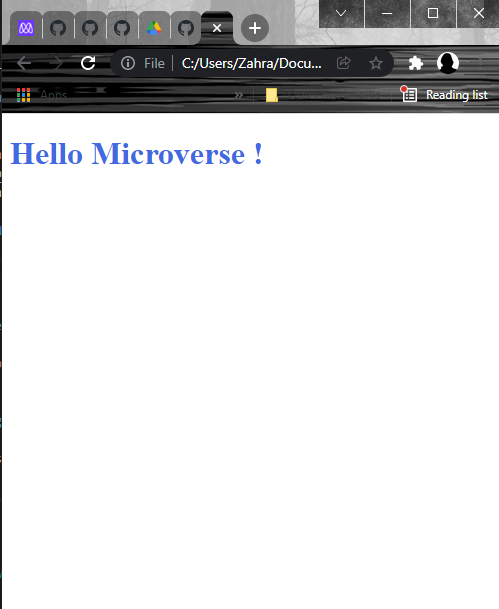

# Seting up a "Hello Microverse" project

> its the first project to creat a simple header line!

there is no special features in this project yet! its just a header!!!

## Built With

- Html
- CSS

## Live Demo

[Live Demo Link](https://rawcdn.githack.com/ZahraArshia/hello-microverse/f855d5017e3627c091e939ddfe5659d5aeccb70e/index.html)

## Getting Started

its so easy to use this one line project! just get a copy and run it!

## Authors

👤 **Zahra**

- GitHub: [@githubhandle](https://github.com/ZahraArshia)

## 🤝 Contributing

Contributions, issues, and feature requests are welcome!

Feel free to check the [issues page](../../issues/).

## Show your support

Give a ⭐️ if you like this project!

## Acknowledgments

- have a nice day!

## 📝 License

This project is [MIT](./MIT.md) licensed.
